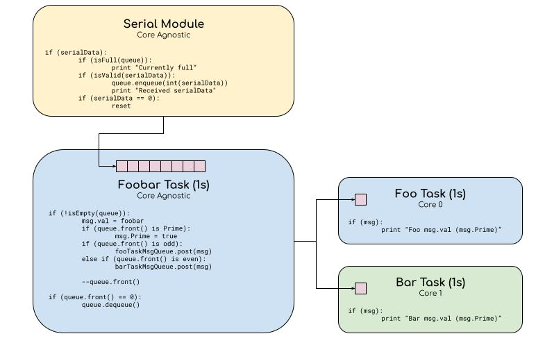

# Foobar Assignment

## Block Diagram

Several assumptions and design decisions were made to try to achieve something within 6 to 8 working hours.

## Assumptions

1. Serial driver exists (assume RS232/485 UART connection for simplicity)

   This assumption was made to simplify the transceiver model. I assume some other part of the system has initiated the driver code and will handle console message formatting leaving the crux of this problem around synchronization of messaging.

2. Serial reception is thread-safe and interrupt driven. Once data is completed, the serial driver interrupt sends data to the serial module via a function call. By thread-safe, access to the serial will be controlled by a mutex/spinlock to minimize contention.
Foobar Task, the main task, is left core agnostic. Technically all tasks run on a 1 second period, so you could encapsulate either the Foo or Bar task into the Foobar task if you didn’t mind locking the Foobar task to a particular core.

## Design Decisions

1. Tasks are designed based on timing and cores, that is one task per core per time interval.
2. The serial module would run in a generic worker that is responsive enough to handle asynchronous serial data. The logic in this module is large enough that we want to avoid placing it in the serial ISR.
3. Message queues are used to coordinate the tasks, specifically for the Foobar task to know what value it should be processing and the child tasks to indicate what string to print out.
4. I would generally conform to the rest of the architecture; but have chosen to use static memory allocation over dynamic when possible to reduce the risk of memory leaks.
5. Problem space seems task/routine oriented, so did not see the need to implement any classes/object-oriented designs.

## Module Descriptions

### Serial Module

The Serial module handles incoming asynchronous messaging from the serial interface. It operates outside of the 1 second time interval that the other tasks adhere to. As such, this could be placed in a generic worker thread that serves requests at a much higher rate at perhaps a lower priority.

Its primary purpose in the problem scope is to handle the bandwidth of requests coming from the serial connection. As such, it will make decisions to queue or drop requests based on Foobar’s associated message queue and provide feedback. It also responds to system reset responses should the value ‘0’ be received.

### Foobar Task

The rest of the tasks operate in its own context. As mentioned in the design decisions, if this task is pinned to a particular core, you could also combine the logic of either the Foo or Bar tasks within the Foobar task as they operate on the same time interval.

The Foobar tasks performs the equivalent Fizzbuzz logic behaviour given that a message has been delivered to it by the Serial module.

### Foo and Bar Tasks

These tasks will only need to print the expected output message.

## Retrospective and Stretch Goals

1. Test on target. Unfortunately I do not have an ESP32-based microcontroller with me. The code compiles when brought into an existing ESP32 project, but I am yet to test it on target.
2. Unit testing. A good engineer backs up their work with several levels of automated testing via CI/CD. I’ve used various test frameworks in the past to unit test embedded systems both on-target and in simulation/emulation.
3. Refactor Foo and Bar tasks to use common code. These two tasks are pretty much identical and can be consolidated into a single task routine that is spawned on each core. Initial parameters can be passed in to ensure the print strings are different.
4. I did not use a lot of C++ mechanisms as I generally think they bring in a lot of bloat on a project. I’ve worked with embedded Linux systems before where we wrote modules in C++ and got to use auto/smart pointers, boost libraries and created a full OO design, but that seemed unnecessary for this particular task.
5. Stack sizes should be optimized. I like to give a lot of stack space to begin with and then optimize down. FreeRTOS supplies some stack watermark features that can assist with this.
